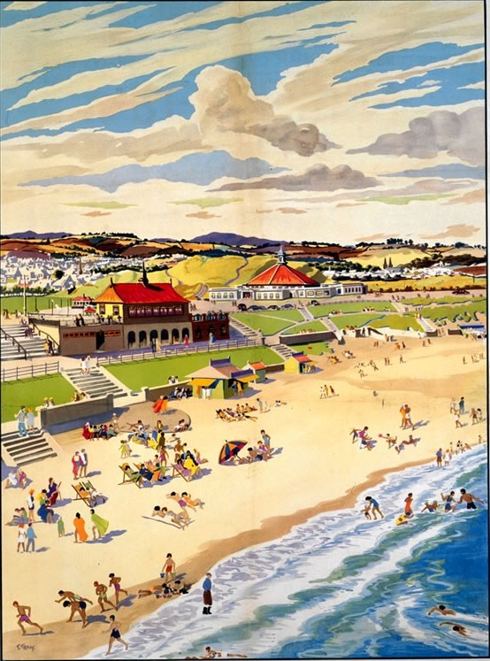
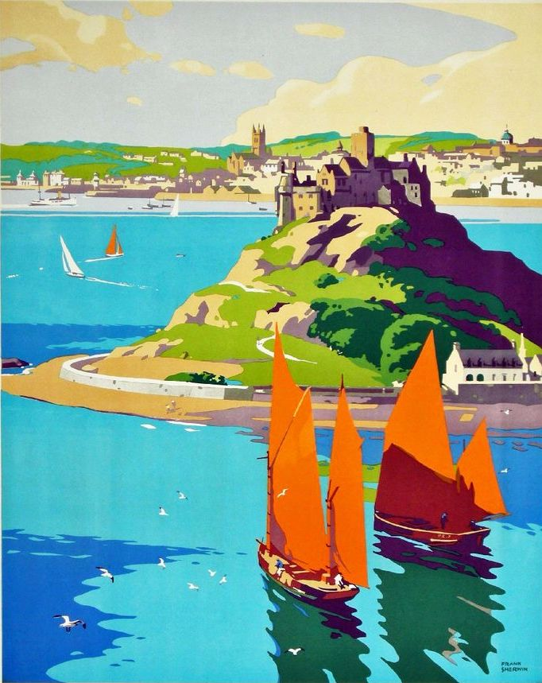
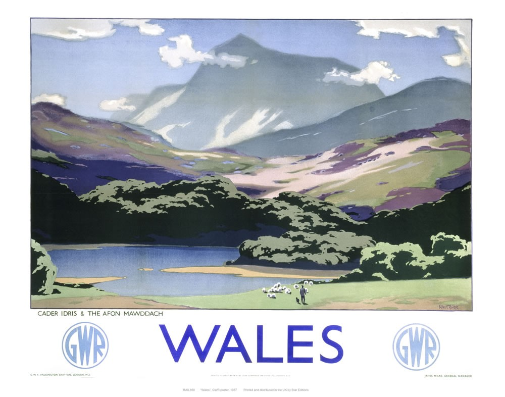
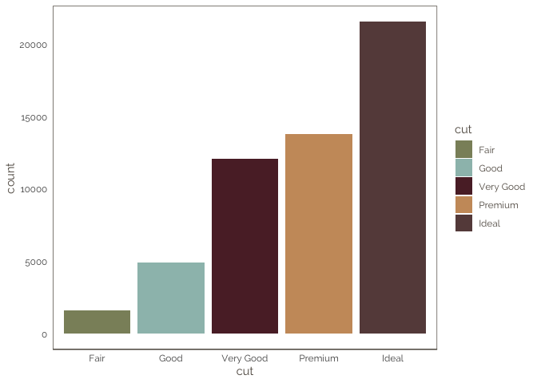
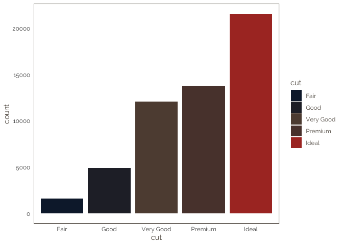
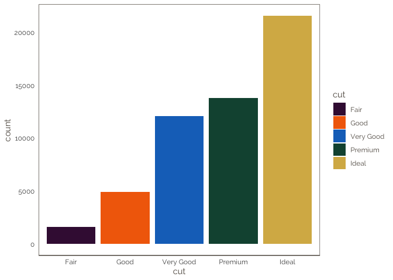

<!-- README.md is generated from README.Rmd. Please edit that file -->

# pmthemes

This is a small package containing functions for producing consistent
documents and figures for scientific reports.

## Installation

You can install pmthemes() from github with:

``` r
# install.packages("devtools")
devtools::install_github("petermacp/pmthemes")
```

## Overall theme

The `theme_pm()` function is the workhorse of the package, providing a
simple theme for scientific presentations and documents.

``` r
library(ggplot2)
library(palmerpenguins)
library(pmthemes)

ggplot(data = penguins, aes(x = flipper_length_mm, y = body_mass_g)) +
  geom_point(aes(color = species, 
                 shape = species),
             size = 2) +
  facet_grid(~species) +
  scale_color_manual(values = c("darkorange","darkorchid","cyan4"))  + 
  labs(title = "This is a test graph", 
       subtitle = "Showing theme_pm()",
       caption = "Data from the palmerpenguins package") +
  theme_pm()
#> Warning: Removed 2 rows containing missing values (geom_point).
```

<!-- -->

### Vintage rail poster colour themes

The `scale_colour_rail()` and `scale_fill_rail()` functions are used to
define colour palettes for aesthetics specified in the scale name.

Much of the code for extracting colour palettes from images using a
k-means clustering images was taken from:
<http://www.milanor.net/blog/build-color-palette-from-image-with-paletter/>

There are seven different palettes, each based on a vintage British
railway poster:

### aberdeen



<br>

### cornwall


<br>

### harrogate


<br>

### penzance



<br>

### somerset


<br>

### wales



<br>

### yorkshirecoast


## Examples

An example using the `cornwall` palette.

``` r
library(ggplot2)
library(pmthemes)

ggplot(data = diamonds) +
  geom_bar(aes(x = cut, fill = cut)) + 
  theme_pm() +
  scale_fill_rail(palette="cornwall")
```

<!-- -->

<br>

Here is the `harrogate` palette.

``` r
library(ggplot2)
library(pmthemes)

ggplot(data = diamonds) +
  geom_bar(mapping = aes(x = cut, fill = cut)) + 
  theme_pm() +
  scale_fill_rail(palette="harrogate")
```

<!-- -->

<br>

…and the `penzance` palette.

``` r
ggplot(data = diamonds) +
  geom_bar(mapping = aes(x = cut, fill = cut)) + 
  theme_pm() +
  scale_fill_rail(palette="penzance")
```

<!-- -->

<br>

### R Markdown template

The `pmthemes` package will additionally install an R Markdown template
for writing scientific analysis report.

To use the package, run: `library(pmthemes)`, then `File/New File/R
Markdown/From template`. Then click on the `Analysis template` file to
open a new R Markdown document.

You will need to modify the yaml header to provide your own information.
