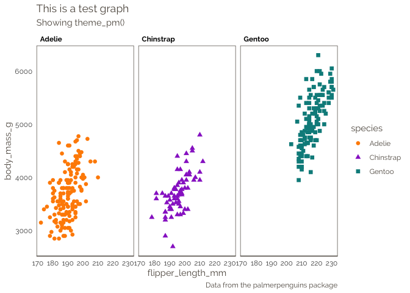

<!-- README.md is generated from README.Rmd. Please edit that file -->
pmthemes
========

This is a small package containing functions for producing consistent documents and figures for scientific reports.

Installation
------------

You can install pmthemes from github with:

``` r
# install.packages("devtools")
devtools::install_github("petermacp/pmthemes")
```

Themes for presentations
------------------------

These themes are intended to be applied to figures that will be projected, for example using PowerPoint or Keynote.

These are opinionated themes. By default: - Font sizes are large to aid comprehension when projected - Sans-serif font is used (Gill sans) - y-axis text is rotated (to avoid readers having to turn their heads!)

### Theme for light-background presentations

`theme_preslight()` is used to format `ggplot` objects destined for display in a scientific presentation with a light background.

*Example:*

``` r
library(ggplot2)
library(pmthemes)

ggplot(mtcars) + geom_point(aes(mpg, wt), colour="darkred") + 
  theme_preslight() + 
  labs(title = "This is a test graph", 
       subtitle = "Showing theme_preslight")
```



### Theme for dark-background presentations

`theme_presdark()` is used to format `ggplot` objects destined for display in a scientific presentation with a dark background.

*Example:*

``` r
library(ggplot2)
library(pmthemes)

ggplot(mtcars) + geom_point(aes(mpg, wt), colour="yellow") + 
  theme_presdark() + 
  labs(title = "This is a test graph", subtitle = "Showing theme_presdark") +
#don't run code after this. 
#Only to demonstrate dark background
  theme(plot.background = element_rect(fill = "midnightblue", colour = NA),
        panel.background = element_rect(fill = "midnightblue", colour = NA))
```

 <br>

### Theme for figures in Word Documents

`theme_wordfig()` is used to format `ggplot` objects destined for inclusion in a word processing document (e.g. a scientific manuscript).

*Example:*

``` r
library(ggplot2)
library(pmthemes)

ggplot(mtcars) + geom_point(aes(mpg, wt), colour="black") + 
  theme_wordfig() + 
  labs(title = "This is a test graph", 
       subtitle = "Showing theme_wordfig")
```


### R Markdown template

The `pmthemes` package will additionally install an R Markdown template for writing scientific analysis report.

To use the package, run: `library(pmthemes)`, then `File/New File/R Markdown/From template`. Then click on the `Analysis template` file to open a new R Markdown document.

You will need to modify the yaml header to provide your own information.
